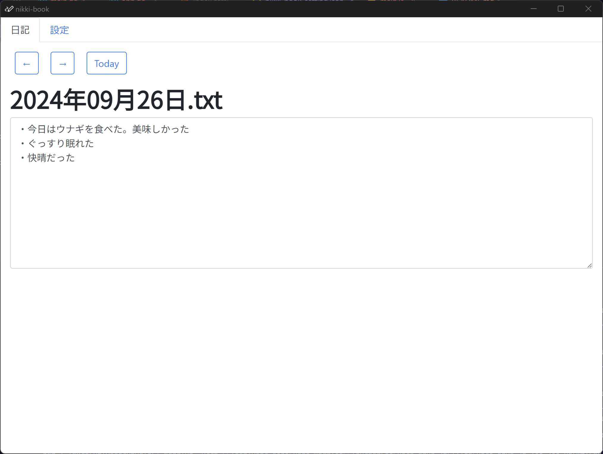
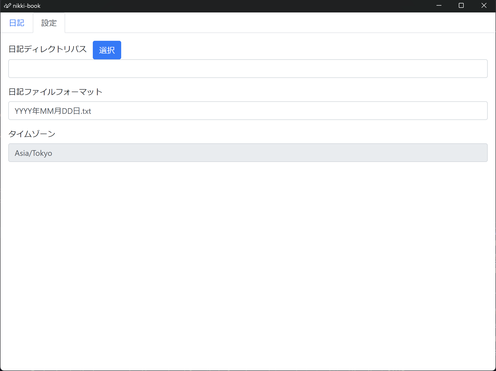

<div align="center">

# nikki-book

wailsで作られたシンプルな日記帳ソフトウェア



<br>
<br>
</div>


## 特徴
* 起動すると、今日の日記入力画面が開くので、すぐに日記を書き始められる※1
* 画像ビューワーのように、日記を見返せる
* ローカルのディレクトリにテキストファイルを作っていくシンプルな構造なので、日記データを扱いやすい


※1 エクスプローラとメモ帳で同等のことを行うと、

1. 日記を保存しているディレクトリをエクスプローラで開く
2. その日の日記のテキストファイルを作り
3. そのテキストファイルをメモ帳で開く

という3ステップが必要になる。


## ⬇️ インストール
[リリース]()からダウンロードして、展開してください。

## 🔨 使い方

### 設定タブ

* 日記ディレクトリパス
  * 右上の選択ボタンを押すと、ダイアログが開き、簡単にディレクトリを選択できます
* 日記ファイルフォーマット
  * YYYYはその日の年度が入ります
  * MMはその日のゼロ詰めの月が入ります
  * DDはその日のゼロ詰めの日が入ります

**設定変更はソフトウェア再起動で反映されます。**

### 日記タブ


「←」ボタンで一つ前の日記へ、「→」ボタンで次の日記へ進みます。    
「Today」ボタンで今日の日記に飛びます。    
変更した内容は日記ディレクトリのテキスファイルに自動保存されます。   

### 日記ディレクトリの構成
[日記ディレクトリの例](./test-dir/)
```text
2024年09月18日.txt
2024年09月19日.txt
```
日記の月日はすべて、ゼロ詰めです。    
ソフトウェア起動時に、今日の日記テキストファイルがない場合、自動的に作成されます。

## 🎫 LICENSE

[MIT](./LICENSE)

## ✍ Author

[PenguinCabinet](https://github.com/PenguinCabinet)
